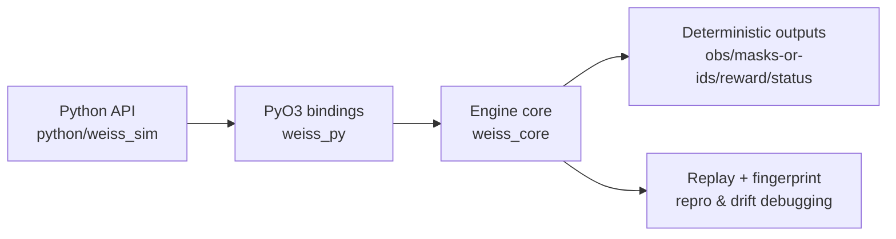

# Weiss Schwarz Simulator

[](https://github.com/victorwp288/weiss-schwarz-simulator/actions/workflows/ci.yml)
[](https://github.com/victorwp288/weiss-schwarz-simulator/actions/workflows/wheels.yml)
[](https://github.com/victorwp288/weiss-schwarz-simulator/actions/workflows/benchmarks.yml)
[](https://github.com/victorwp288/weiss-schwarz-simulator/actions/workflows/security.yml)
[](https://pypi.org/project/weiss-sim/)
[](https://victorwp288.github.io/weiss-schwarz-simulator/rustdoc/)
[](docs/README.md)

Deterministic, batched Weiss Schwarz simulation for reinforcement learning and engine research.

## What you get

- Rust engine (`weiss_core`) with deterministic advance-until-decision stepping
- PyO3 bindings (`weiss_py`) and Python API (`python/weiss_sim`) for batched training/eval loops
- Stable observation/action contracts (`OBS_LEN=378`, `ACTION_SPACE_SIZE=527`, `SPEC_HASH=8590000130`)
- RL-oriented fast paths for packed legal ids, no-metadata layouts, fused sampled log-prob stepping, and optional legal-action context tensors
- Replay and fingerprint surfaces for drift detection and reproducibility

## Release status

`1.0.0` is the stabilized research release line. Public compatibility boundaries are
documented explicitly, and any future encoding, replay, WSDB, or action-space changes
should update the corresponding version constants and docs in the same change.

## 5-minute start

### Option A: install from PyPI

```bash
python -m pip install -U weiss-sim numpy
```

### Option B: local build from source

```bash
python -m pip install -U maturin numpy
python -m maturin develop --release --manifest-path weiss_py/Cargo.toml
```

Run the commands in the Python environment where you want `weiss_sim` installed. If you
are using a virtualenv, activate it first.

### Option C: contributor setup (dev extras + local extension)

```bash
rustup component add rustfmt clippy
python -m venv .venv
# activate the virtualenv before the next commands
# PowerShell: .\.venv\Scripts\Activate.ps1
# Bash / zsh: source .venv/bin/activate
python -m pip install -U pip
python -m pip install -e ".[dev]"
python -m maturin develop --release --manifest-path weiss_py/Cargo.toml
```

This installs `.[dev]` extras (`ruff`, `pytest`, `maturin`, `pip-audit`) and builds the local extension in-place.

Virtualenv activation examples:

- PowerShell: `.\.venv\Scripts\Activate.ps1`
- Bash / zsh: `source .venv/bin/activate`

If you prefer the helper script, `scripts/setup_dev_env.sh` runs the same install flow in Bash-compatible shells.

### Minimal high-level loop

```python
import numpy as np
import weiss_sim

with weiss_sim.fast(num_envs=32, seed=0) as sim:
    reset = sim.reset()
    actions = reset.legal.sample_uniform(seed=123)
    step = sim.step(actions)
```

### Minimal low-level loop

```python
import numpy as np
import weiss_sim

legal_deck = (list(range(1, 14)) * 4)[:50]

pool, buf = weiss_sim.make_pool(
    mode="train",
    num_envs=32,
    deck_lists=[legal_deck, legal_deck],
    deck_ids=[1, 2],
    seed=0,
    layout="i16_legal_ids_nometa",
)
out = buf.reset()
actions = np.full(pool.envs_len, weiss_sim.PASS_ACTION_ID, dtype=np.uint32)
out = buf.step(actions)
```

Throughput-sensitive policy-gradient loops should prefer the fused sampled-logp helper
when they need both sampled actions and behavior log-probabilities:

```python
logits = np.zeros((pool.envs_len, weiss_sim.ACTION_SPACE_SIZE), dtype=np.float32)
seeds = np.arange(pool.envs_len, dtype=np.uint64)
step, actions, logp = buf.step_sample_from_logits_with_logp(logits, seeds)
```

### Deck authoring flow (Python)

```python
import weiss_sim

builder = weiss_sim.cards.builder(initial="starter_deck_ws02_v1")
report = builder.validate(rules_profile="approx", card_pool="all")
if report.ok:
    deck_ids = builder.build(rules_profile="approx", card_pool="all")
```

Bundled presets are the four release decklists: `starter_deck_ws02_v1`,
`control_deck_jj_s66_v1`, `main_deck_5hy_yotsuba_v1`, and
`aggro_deck_5hy_nino_v1`. Inspect the installed package with
`weiss_sim.cards.presets()`. These presets require `rules_profile="approx"` because
they include partially parsed card abilities.

## Architecture at a glance



## Documentation map

Start in [`docs/README.md`](docs/README.md). The docs are intentionally compact:

- [`docs/quickstart.md`](docs/quickstart.md): install, first loop, decks, troubleshooting, and local checks
- [`docs/python_api.md`](docs/python_api.md): high-level API, low-level buffers, layouts, and RL helpers
- [`docs/rl_contract.md`](docs/rl_contract.md): step semantics, rewards, output schema, legal payloads, and compatibility constants
- [`docs/architecture.md`](docs/architecture.md): Rust/Python layers, rules/scraper boundaries, replay determinism, and invariants
- [`docs/performance_benchmarks.md`](docs/performance_benchmarks.md): benchmark commands, current baselines, perf gates, and RL hot paths
- [`CONTRIBUTING.md`](CONTRIBUTING.md): validation, release flow, docs rules, and PR checklist

## Repository layout

- `weiss_core/`: Rust engine and deterministic rule runtime
- `weiss_py/`: PyO3 extension layer
- `python/weiss_sim/`: high-level and low-level Python interfaces
- `python/tests/`: Python API/contract tests
- `scripts/`: CI parity, coverage, perf, and docs checks
- `docs/`: user + contributor documentation hub
- `.github/`: CI, release, issue, and pull request templates

## Local quality checks

Full local CI parity:

```bash
bash scripts/run_local_ci_parity.sh
```

On Windows, run the underlying commands directly from PowerShell:

```powershell
cargo fmt --all -- --check
cargo clippy --workspace --all-targets --all-features -- -D warnings
cargo test --workspace --all-features
python -m ruff format --check python scraper scripts
python -m ruff check python scraper scripts
python scripts/check_docs_links.py
python scripts/check_docs_constants.py
python scripts/gen_docs_snippets.py --check
python -m pytest -q python/tests
```

Skip benchmark gate during iteration:

```bash
SKIP_BENCHMARKS=1 bash scripts/run_local_ci_parity.sh
```

Docs-only checks:

```bash
python scripts/check_docs_links.py
python scripts/check_docs_constants.py
python scripts/gen_docs_snippets.py --check
```

## Benchmark snapshot (main)

<!-- BENCHMARKS:START -->
_Last updated: 2026-05-11_

| Benchmark | Time |
| --- | --- |
| rust/advance_until_decision | 21272 ns/iter |
| rust/step_batch_64 | 9581 ns/iter |
| rust/reset_batch_256 | 512004 ns/iter |
| rust/step_batch_fast_256_priority_off | 39563 ns/iter |
| rust/step_batch_fast_256_priority_on | 42891 ns/iter |
| rust/legal_actions | 4 ns/iter |
| rust/legal_actions_forced | 4 ns/iter |
| rust/on_reverse_decision_frequency_on | 990 ns/iter |
| rust/on_reverse_decision_frequency_off | 1006 ns/iter |
| rust/observation_encode | 80 ns/iter |
| rust/observation_encode_forced | 79 ns/iter |
| rust/mask_construction | 180 ns/iter |
| rust/mask_construction_forced | 178 ns/iter |
| python/reset_into | 75.8 us/reset |
| python/step(mask) | 2602377 env-steps/sec |
| python/step(ids) | 4929457 env-steps/sec |
<!-- BENCHMARKS:END -->

Long-form benchmark docs: [`docs/performance_benchmarks.md`](docs/performance_benchmarks.md)

## Compatibility policy

Contract constants are explicit compatibility boundaries:

- `OBS_ENCODING_VERSION=2`
- `ACTION_ENCODING_VERSION=1`
- `POLICY_VERSION=2`
- `REPLAY_SCHEMA_VERSION=3`
- `WSDB_SCHEMA_VERSION=2`

If encoding/layout semantics change, update code + docs in the same PR:

1. constants/encode implementation
2. [`docs/rl_contract.md`](docs/rl_contract.md) checksum table
3. [`docs/architecture.md`](docs/architecture.md) compatibility notes when replay/WSDB/runtime boundaries change

## License

MIT OR Apache-2.0
