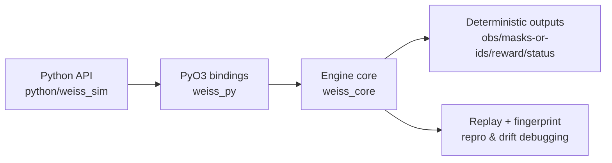

# Weiss Schwarz Simulator

[](https://github.com/victorwp288/weiss-schwarz-simulator/actions/workflows/ci.yml)
[](https://github.com/victorwp288/weiss-schwarz-simulator/actions/workflows/wheels.yml)
[](https://github.com/victorwp288/weiss-schwarz-simulator/actions/workflows/benchmarks.yml)
[](https://github.com/victorwp288/weiss-schwarz-simulator/actions/workflows/security.yml)
[](https://pypi.org/project/weiss-sim/)
[](https://victorwp288.github.io/weiss-schwarz-simulator/rustdoc/)
[](docs/README.md)

Deterministic Weiss Schwarz simulation for RL and engine research.

## What you get

- Rust engine (`weiss_core`) with deterministic advance-until-decision stepping
- PyO3 bindings (`weiss_py`) and Python API (`python/weiss_sim`) for batched training/eval loops
- Stable observation/action contracts (`OBS_LEN=378`, `ACTION_SPACE_SIZE=527`, `SPEC_HASH=8590000130`)
- Replay and fingerprint surfaces for drift detection and reproducibility

## 5-minute start

### Option A: install from PyPI

```bash
python -m pip install -U weiss-sim numpy
```

### Option B: local build from source

```bash
python -m pip install -U maturin numpy
maturin develop --release --manifest-path weiss_py/Cargo.toml
```

### Minimal high-level loop

```python
import numpy as np
import weiss_sim

sim = weiss_sim.train(num_envs=32, seed=0)
reset = sim.reset()
actions = np.full((32,), weiss_sim.PASS_ACTION_ID, dtype=np.uint32)
step = sim.step(actions)
```

### Minimal low-level loop

```python
import numpy as np
import weiss_sim

legal_deck = (list(range(1, 14)) * 4)[:50]

pool = weiss_sim.EnvPool.new_rl_train(
    32,
    deck_lists=[legal_deck, legal_deck],
    deck_ids=[1, 2],
    seed=0,
)
buf = weiss_sim.EnvPoolBuffers(pool)
out = buf.reset()
actions = np.full(pool.envs_len, weiss_sim.PASS_ACTION_ID, dtype=np.uint32)
out = buf.step(actions)
```

## Architecture at a glance



## Documentation map

Start in [`docs/README.md`](docs/README.md).

Recommended paths:

- RL users: [`docs/quickstart.md`](docs/quickstart.md) -> [`docs/rl_contract.md`](docs/rl_contract.md) -> [`docs/encodings.md`](docs/encodings.md)
- Python integrators: [`docs/python_api.md`](docs/python_api.md) -> [`docs/troubleshooting.md`](docs/troubleshooting.md)
- Engine contributors: [`docs/engine_architecture.md`](docs/engine_architecture.md) -> [`docs/rules_coverage.md`](docs/rules_coverage.md) -> [`PROJECT_STATE.md`](PROJECT_STATE.md)
- Performance work: [`docs/performance_benchmarks.md`](docs/performance_benchmarks.md)

## Repository layout

- `weiss_core/`: Rust engine and deterministic rule runtime
- `weiss_py/`: PyO3 extension layer
- `python/weiss_sim/`: high-level and low-level Python interfaces
- `python/tests/`: Python API/contract tests
- `scripts/`: CI parity, coverage, perf, and docs checks
- `docs/`: user + contributor documentation hub

## Local quality checks

Full local CI parity:

```bash
scripts/run_local_ci_parity.sh
```

Skip benchmark gate during iteration:

```bash
SKIP_BENCHMARKS=1 scripts/run_local_ci_parity.sh
```

Docs-only checks:

```bash
python scripts/check_docs_links.py
python scripts/check_docs_constants.py
```

## Benchmark snapshot (main)

<!-- BENCHMARKS:START -->
_Last updated: 2026-02-18 10:58 UTC_

| Benchmark | Time |
| --- | --- |
| rust/advance_until_decision | 51573 ns/iter |
| rust/step_batch_64 | 15566 ns/iter |
| rust/reset_batch_256 | 893236 ns/iter |
| rust/step_batch_fast_256_priority_off | 74777 ns/iter |
| rust/step_batch_fast_256_priority_on | 68299 ns/iter |
| rust/legal_actions | 13 ns/iter |
| rust/legal_actions_forced | 12 ns/iter |
| rust/on_reverse_decision_frequency_on | 1186 ns/iter |
| rust/on_reverse_decision_frequency_off | 1237 ns/iter |
| rust/observation_encode | 178 ns/iter |
| rust/observation_encode_forced | 188 ns/iter |
| rust/mask_construction | 397 ns/iter |
<!-- BENCHMARKS:END -->

Long-form benchmark docs: [`docs/performance_benchmarks.md`](docs/performance_benchmarks.md)

## Compatibility policy

Contract constants are explicit compatibility boundaries:

- `OBS_ENCODING_VERSION=2`
- `ACTION_ENCODING_VERSION=1`
- `POLICY_VERSION=2`
- `REPLAY_SCHEMA_VERSION=2`
- `WSDB_SCHEMA_VERSION=2`

If encoding/layout semantics change, update code + docs in the same PR:

1. constants/encode implementation
2. [`docs/rl_contract.md`](docs/rl_contract.md) checksum table
3. [`docs/encodings_changelog.md`](docs/encodings_changelog.md)

## License

MIT OR Apache-2.0
