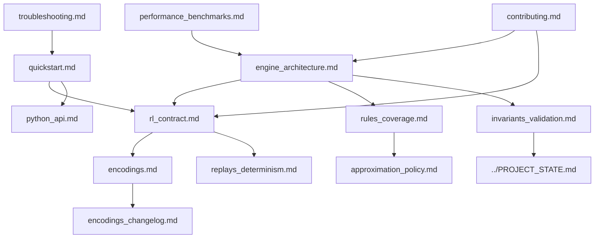

# Documentation Hub

[](../.github/workflows/ci.yml)
[](https://victorwp288.github.io/weiss-schwarz-simulator/rustdoc/)

This is the canonical map for repository docs.

## Read by goal

### I want to run training quickly

1. [Quickstart](quickstart.md)
2. [RL Contract](rl_contract.md)
3. [Python API](python_api.md)

### I want to integrate or extend Python tooling

1. [Python API](python_api.md)
2. [Encodings](encodings.md)
3. [Troubleshooting](troubleshooting.md)

### I want to modify engine behavior

1. [Engine Architecture](engine_architecture.md)
2. [Rules Coverage](rules_coverage.md)
3. [Invariants & Validation](invariants_validation.md)
4. [Project State](../PROJECT_STATE.md)

### I want to investigate determinism or replay drift

1. [Replays & Determinism](replays_determinism.md)
2. [RL Contract](rl_contract.md)
3. [Invariants & Validation](invariants_validation.md)

### I want to profile performance

1. [Performance & Benchmarks](performance_benchmarks.md)
2. [Engine Architecture](engine_architecture.md)
3. [Contributing](contributing.md)

## Docs graph



## Full docs index

- [Quickstart](quickstart.md): install paths, first reset/step, and integration sanity checks.
- [Python API](python_api.md): `make/fast/inspect`, `WeissEnv`, `batch.legal`, and canonical low-level APIs (`make_pool`, `EnvPoolBuffers`, `EnvPoolTrajectoryBuffers`, `reset_rl`, `step_rl`, logits helpers).
- [RL Contract](rl_contract.md): step semantics, output schema, and compatibility checksum table.
- [Encodings](encodings.md): observation/action spec model and compatibility process.
- [Encodings Changelog](encodings_changelog.md): append-only encoding/schema history.
- [Engine Architecture](engine_architecture.md): runtime loop, layers, ordering, and safeguards.
- [Rules Coverage](rules_coverage.md): implemented areas, local policy choices, and coverage tooling.
- [Approximation Policy](approximation_policy.md): approved deterministic approximations and gating.
- [Replays & Determinism](replays_determinism.md): replay payloads, visibility modes, and drift workflows.
- [Performance & Benchmarks](performance_benchmarks.md): perf snapshots, budget gates, and baseline regeneration.
- [Invariants & Validation](invariants_validation.md): constants, fault codes, and validation paths.
- [Troubleshooting](troubleshooting.md): common setup/runtime/perf issues and exact fixes.
- [Contributing](contributing.md): branch/PR workflow and required quality gates.
- [Freeze Preflight 2/3/5](freeze_preflight_235.md): freeze artifact runbook.

Repository-level references:

- [Root README](../README.md)
- [Project State](../PROJECT_STATE.md)
- [CHANGELOG](../CHANGELOG.md)

## Doc update rules

When behavior changes, docs change in the same PR.

1. Update the relevant page under `docs/`.
2. If encoding/layout changed, update both:
   - [RL Contract checksum table](rl_contract.md)
   - [Encodings changelog](encodings_changelog.md)
3. Keep [Project State](../PROJECT_STATE.md) aligned with actual runtime behavior.
4. Run:

```bash
python scripts/check_docs_links.py
python scripts/check_docs_constants.py
```
