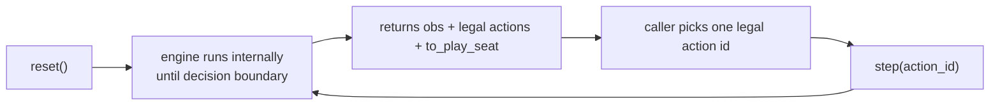

# Beginner Happy Path (Deck -> API -> Engine Loop)

This is the long-form beginner guide for the simplest successful path through the simulator.

Goal: go from a deck to a working `reset -> legal action -> step` loop with only the calls you actually need.

If this page and code disagree, code is authoritative.

## What you will do

1. Install `weiss-sim`
2. Build and validate a legal deck
3. Start a high-level environment with `weiss_sim.make(...)`
4. Call `reset()`
5. Pick a legal action with `batch.legal`
6. Call `step(actions)`
7. Repeat in a short loop

## 1) Install

```bash
python -m pip install -U weiss-sim numpy
```

Local source build (optional):

```bash
python -m pip install -U maturin numpy
maturin develop --release --manifest-path weiss_py/Cargo.toml
```

## 2) Build a legal deck (minimal path)

Use the packaged starter preset, validate it, then materialize the final 50-card id list.

```python
import weiss_sim

builder = weiss_sim.cards.builder(initial="starter_v1")

report = builder.validate(
    rules_profile="strict",
    card_pool="all",
)
if not report.ok:
    for issue in report.errors:
        print(issue.code, issue.message)
    raise SystemExit("Deck is not legal")

deck_ids = builder.build(
    rules_profile="strict",
    card_pool="all",
)
print(len(deck_ids))  # should be 50
```

Why this is the happy path:

- no manual card-id discovery required
- deck legality is checked before you create the env
- `deck_ids` is exactly what `make(...)` expects

## 3) Create the environment and do one step

This is the minimum end-to-end call sequence most users need.

```python
import weiss_sim

with weiss_sim.make(
    mode="fast",
    deck=deck_ids,
    opponent_deck=deck_ids,
    rules_profile="strict",
    card_pool="all",
    num_envs=1,
    seed=0,
) as sim:
    batch = sim.reset()

    actions = batch.legal.first_legal()
    step = sim.step(actions)

    print("obs shape:", step.obs.shape)
    print("reward:", step.reward)
    print("engine_status:", step.engine_status)
```

That is the full minimal happy path.

## 4) Run a short loop (still minimal)

```python
import numpy as np
import weiss_sim

with weiss_sim.make(
    mode="fast",
    deck=deck_ids,
    opponent_deck=deck_ids,
    rules_profile="strict",
    card_pool="all",
    num_envs=8,
    seed=7,
) as sim:
    batch = sim.reset()

    for t in range(100):
        actions = batch.legal.sample_uniform(seed=1000 + t)
        step = sim.step(actions)

        done = np.logical_or(step.terminated, step.truncated)
        engine_error = step.engine_status != 0

        if np.any(engine_error):
            _, reset_batch = sim.auto_reset_on_engine_errors(step.engine_status)
            if reset_batch is not None:
                batch = reset_batch
                continue

        if np.any(done):
            batch = sim.reset_done(done)
            continue

        batch = step
```

## 5) How the engine and API interact

The key model: the engine advances internally until it reaches the next decision boundary.



### What `reset()` does

- Creates/refreshes episode state.
- Runs the Rust runtime until the first decision is required.
- Returns a `ResetBatch` with:
  - `obs`
  - `to_play_seat`
  - legal action surface (`batch.legal`, and optionally raw ids/mask)

### What `step(actions)` does

- Applies exactly one action per env row.
- Internally resolves phase progression, triggers, stack/priority windows, and rule actions.
- Stops at the next decision (or terminal/truncated boundary).
- Returns `StepBatch` (`obs`, `reward`, `terminated`, `truncated`, `engine_status`, legal actions for the next boundary).

### Why `batch.legal` matters

- Rust computes canonical legal actions.
- Python exposes them through `batch.legal` helpers (`ids`, `contains`, `first_legal`, `sample_uniform`, logits helpers).
- You should choose actions from `batch.legal` rather than constructing ids manually.

### Actor and reward perspective

- `to_play_seat` tells you which seat is acting at the current boundary.
- Reward is emitted from the acting seat's perspective for that boundary.

## 6) Calls you can ignore at first

You can build strong loops without these initially:

- low-level layouts/buffers (`make_pool`, `EnvPoolBuffers`, `reset_rl`, `step_rl`)
- replay sampling
- Gym adapters
- custom reward/curriculum payloads

Start with:

- `cards.builder(...)`
- `builder.validate(...)`
- `builder.build(...)`
- `make(...)`
- `reset()`
- `batch.legal.*`
- `step(...)`

## 7) Where to go next

- [Quickstart](quickstart.md)
- [How it works](how_it_works.md)
- [Rules coverage (implemented vs partial/pending)](rules_coverage.md)
- [Python API guide](python_api.md)
- [RL contract](rl_contract.md)
