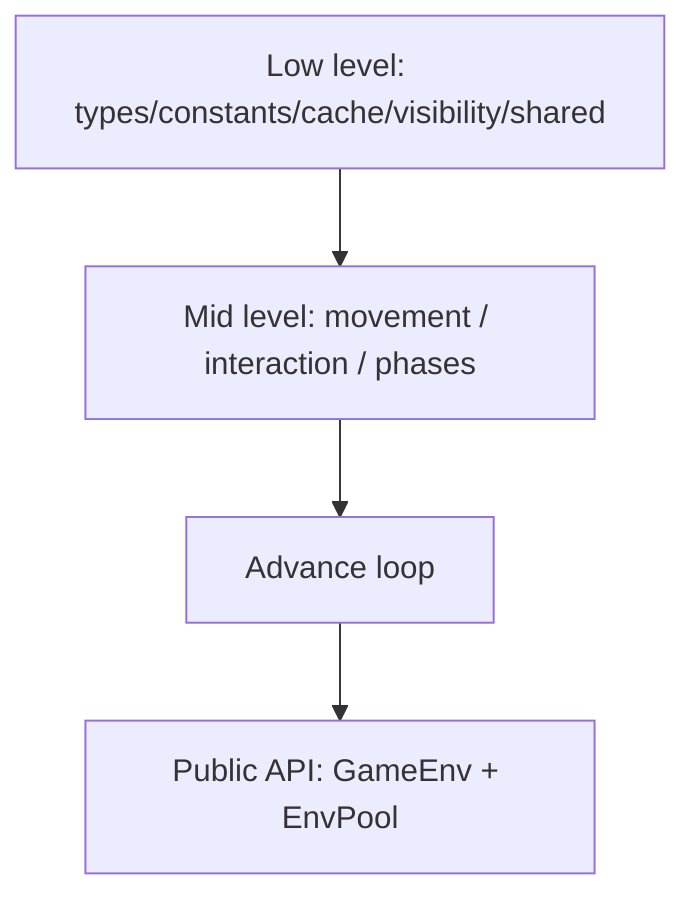
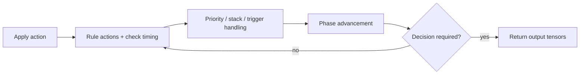

# Engine Architecture

**TL;DR**
- The engine runs an internal loop until a decision must be made.
- Determinism comes from canonical ordering, explicit caps, and stable encodings.
- Module boundaries are intentionally strict and checked in CI.

[Overview](README.md) | [Quickstart](quickstart.md) | Engine | [RL Contract](rl_contract.md) | [Encodings](encodings.md) | [Performance](performance_benchmarks.md) | [Replays](replays_determinism.md) | [Rules](rules_coverage.md) | [Invariants](invariants_validation.md) | [Contributing](contributing.md)

---

## On this page

- Layering model
- Runtime loop
- Action pipeline
- Effect and targeting pipeline
- Timing and priority behavior
- Failure surfaces

---

## Layering model

Primary modules:

- `env/actions/`: legal action generation + action application
- `env/movement/`: zone movement, play rules, level/encore/stock/draw helpers
- `env/interaction/`: choice/targeting/cost/effect queue/stack logic
- `env/phases/`: phase-local rule behavior (attack, end, trigger, rule actions)
- `env/advance/`: internal state-machine driver that progresses to next decision
- `pool/`: batched stepping, output writing, threading helpers

Layering constraints are enforced by `scripts/check_env_layering.sh` and CI.

Practical rule:

- put reusable logic into `movement`, `interaction`, or `phases`
- keep `advance` as the orchestration layer, not a logic dump

---

## Runtime loop (advance-until-decision)

Core contract: one external `step` call may execute many internal game operations, but returns only when the next decision boundary is reached (or episode ends).

Simplified flow:

1. apply caller action
2. run immediate rule actions and check-timing queues
3. resolve stack/trigger windows according to curriculum flags
4. progress phase/tick state
5. stop at decision boundary or terminal/truncated state

This is why caller loops are decision-based, not per micro-transition.

---

## Action pipeline

The canonical source of legal behavior is `ActionDesc`.

Pipeline:

1. build legal canonical actions from `DecisionKind`
2. map canonical actions to action ids (fixed action space)
3. derive mask/legal-id outputs from the same canonical set
4. apply selected action id

Important implications:

- masks and legal ids are views, not independent truth sources
- if canonical legality changes, action encoding docs/tests must be updated
- policy code should treat illegal ids as errors, not fallback behavior

---

## Effect and targeting pipeline

Current architecture is mostly unified through effect payload resolution:

1. compile effects from triggers/abilities/events
2. enumerate target candidates deterministically
3. enqueue stack items when needed
4. resolve with explicit ordering and bounded loops

Determinism safeguards:

- canonical ability order helper from `CardDb`
- slot/index ordered targeting and action ordering
- explicit auto-resolve caps for unstable loops

Known direct-path exceptions (intentional, documented):

- some counter movement/cost handling
- continuous modifiers that apply immediately
- refresh/refresh-penalty zone operations

Granted ability runtime notes:

- live ability lookup merges static DB abilities and temporary granted abilities in deterministic order.
- encore variant cost discovery now reads from live abilities, so temporarily granted `Encore [...]` costs are honored during encore decisions.

---

## Timing and priority behavior

Timing windows are explicit and flag-driven.

- `enable_priority_windows=false` (default): stack auto-resolves deterministically
- `enable_priority_windows=true`: priority actions are exposed via `Choice`

Priority window behavior summary:

- single legal action can autopick when configured
- pass behavior is governed by curriculum flags
- double pass closes a priority window and continues resolution

Choice paging:

- fixed page size (`16`)
- deterministic ordering
- no candidate-universe truncation

---

## Failure surfaces and safeguards

Engine error codes are surfaced per env through `engine_status`.

Representative non-zero codes:

- stack auto-resolve cap exceeded
- trigger quiescence cap exceeded
- action application error
- trapped runtime panic (`Panic`)
- reset returned an error (`ResetError`)
- trapped reset panic (`ResetPanic`)
- runtime invariant violation (`InvariantViolation`)

Operational guidance:

- keep training loops checking `engine_status`
- use `auto_reset_on_error_codes_into(...)` where long-running jobs need robustness
- treat non-zero codes as contract signals, not ignorable warnings
- build Python extension paths with `panic=unwind` so per-env panic containment is effective

---

## Where to read next

- [RL contract](rl_contract.md)
- [Rules coverage](rules_coverage.md)
- [Invariants & validation](invariants_validation.md)
- [Replays & determinism](replays_determinism.md)
