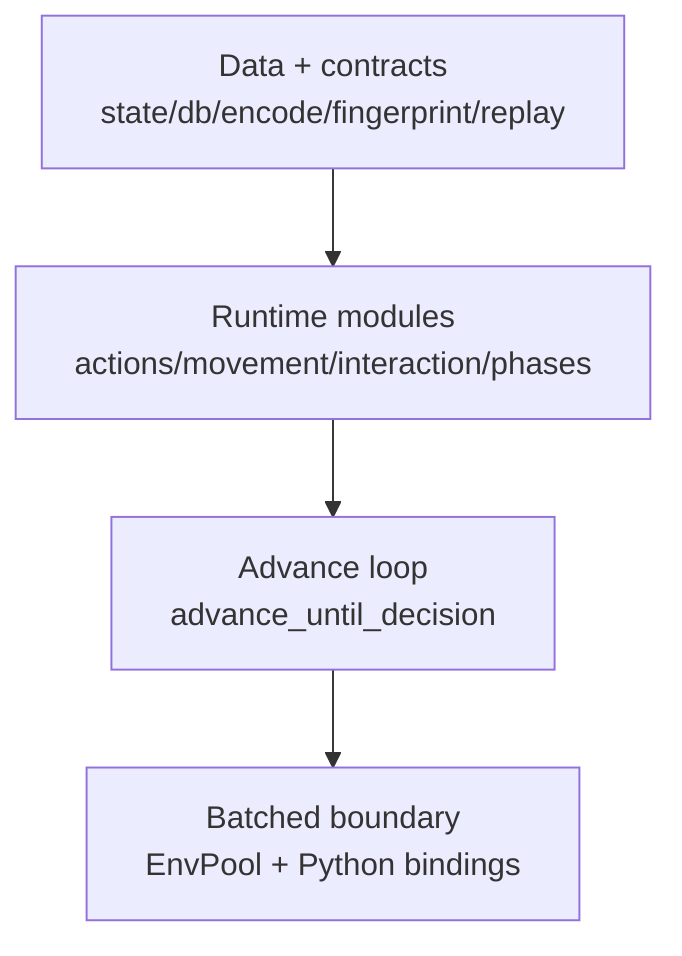
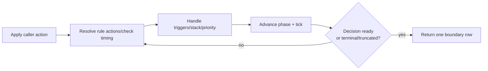

# Engine Architecture

This page describes how the runtime executes decisions, preserves determinism, and exposes a stable RL-facing surface.

## Layer model

High-level module responsibilities:

- `weiss_core/src/encode/`: action/observation encodings and spec JSON
- `weiss_core/src/env/actions/`: canonical legal action generation + application
- `weiss_core/src/env/movement/`: zone/card movement and play constraints
- `weiss_core/src/env/interaction/`: costs, targeting, stack, priority, choices
- `weiss_core/src/env/phases/`: phase-specific rules/check-timing logic
- `weiss_core/src/env/advance/`: internal progression loop
- `weiss_core/src/pool/`: batched stepping, fault handling, output assembly

Layering guardrail: `scripts/check_env_layering.sh`

## Runtime control flow

Core loop: `GameEnv::advance_until_decision`.

Key properties:

- one external `step` can include many internal transitions
- returns only at a decision boundary or end state
- stack/check-timing loops are bounded:
  - `STACK_AUTO_RESOLVE_CAP=256`
  - `CHECK_TIMING_QUIESCENCE_CAP=256`

## Action pipeline

Action truth source is canonical `ActionDesc`.

1. build legal canonical actions for current `DecisionKind`
2. map canonical actions into fixed action ids
3. expose derived legal surfaces (mask and/or packed ids)
4. apply selected action id

Implication: masks and legal-id vectors are derived views, not independent legality logic.

## Determinism model

Determinism comes from explicit ordering and serialized state hashing.

Ordering guarantees are enforced by implementation choices such as:

- canonical ability ordering in DB load/lookup paths
- stable slot/index traversal in legality and targeting
- deterministic choice paging (`CHOICE_COUNT=16`)
- explicit caps for runaway trigger/stack behavior

Replay/fingerprint support:

- `state_fingerprint(...)`
- `events_fingerprint(...)`
- replay metadata includes `spec_hash`, `config_hash`, seeds, and versions

## Priority, stack, and trigger behavior

- Priority windows are curriculum-gated (`enable_priority_windows`).
- Priority actions are represented as `Choice` decisions.
- Passing can close the window and continue stack resolution.
- Trigger effects are sorted with deterministic keys before resolution.
- Stack ordering is deterministic and can surface explicit ordering decisions when needed.

## Fault surfaces

Per-env runtime faults are surfaced via `engine_status`.

| Code | Name |
| --- | --- |
| `0` | `None` |
| `1` | `StackAutoResolveCap` |
| `2` | `TriggerQuiescenceCap` |
| `3` | `Panic` |
| `4` | `ActionError` |
| `5` | `InvariantViolation` |
| `6` | `ResetError` |
| `7` | `ResetPanic` |

Operational guidance:

- treat non-zero `engine_status` as contract-relevant state
- use auto-reset helpers for long-running jobs
- monitor counts via `engine_error_reset_count()`

## Visibility and replay sanitization

- output/replay sanitization is applied at serialization/output boundaries
- replay visibility mode controls whether raw or public-sanitized actions/events are written
- hidden-zone identifiers are masked in public outputs

## Related

- [RL Contract](rl_contract.md)
- [Rules Coverage](rules_coverage.md)
- [Replays & Determinism](replays_determinism.md)
- [Invariants & Validation](invariants_validation.md)
