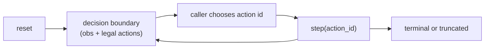
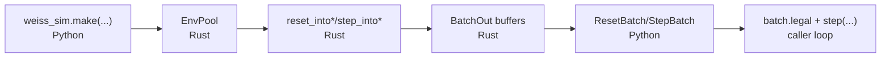
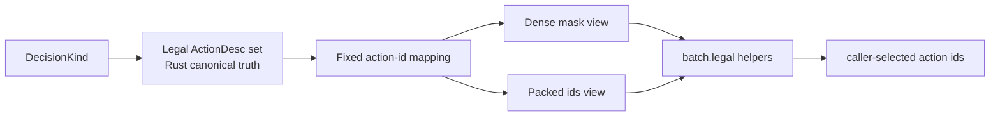

# How it works

This page is the practical mental model for how the simulator executes, where boundaries occur, and how Python calls map to engine behavior.

If this page and the code disagree, **the code is authoritative** and this page must be updated in the same PR.

## Core idea: decision-boundary stepping

The engine runs an internal loop (`advance_until_decision`) and only returns control at decision boundaries.

At each boundary:

- caller provides exactly one action id per env row
- engine applies it
- engine advances internally until next boundary or terminal/truncated state
- engine returns next observation + next legal actions

One external `step()` may include many internal transitions (timing checks, triggers, stack resolution, phase changes).

## End-to-end call path (Python -> Rust -> Python)

High-level path (`weiss_sim.make/fast/inspect`):

1. Python normalizes config + decks.
2. Python creates a Rust `EnvPool`.
3. `reset()`/`step()` call Rust `reset_into*` / `step_into*` methods.
4. Rust fills preallocated batch buffers.
5. Python wraps these as `ResetBatch` / `StepBatch` with `batch.legal` helpers.

## What happens during `reset()`

`reset()` is not just "clear state". It also advances to the first playable boundary.

Returned `ResetBatch` includes:

- `obs`
- `to_play_seat`
- `decision_id`
- `engine_status`
- legal action payload (`batch.legal`, and optional raw `legal_mask` / `legal_ids` + `legal_offsets`)

So after `reset()`, you can immediately choose a legal action and call `step()`.

## What happens during `step(actions)`

For each env row:

1. apply one action id for current actor
2. run internal progression loop
3. stop at next boundary or end
4. emit one `StepBatch` row

`StepBatch` adds:

- `reward`
- `terminated`
- `truncated`
- `decision_count`
- `tick_count`

Important: `terminated` and `truncated` are mutually exclusive per row.

## Who acts next: `to_play_seat` / `actor`

At each boundary, the engine reports the actor seat:

- high-level: `ResetBatch.to_play_seat` / `StepBatch.to_play_seat`
- low-level: `BatchOut*.actor`

Conventions:

- `0` / `1`: acting seat
- `-1`: no actor (for example terminal rows)

Use this for self-play orchestration and per-seat policy dispatch.

## Legal actions: canonical source and derived views

Legality is computed once in Rust from canonical action descriptors and projected into fixed action ids.

Python can expose legality as:

- dense mask
- packed ids + offsets
- both

`batch.legal` is the preferred integration surface regardless of underlying representation.

## Reward, terminal, and fault model

Reward is emitted from the acting seat's perspective for the boundary.

Status surfaces:

- `terminated=True`: game ended in win/loss/draw
- `truncated=True`: limit/fault truncation (for example decision/tick cap or latched fault)
- `engine_status!=0`: engine fault code is latched until reset

Operationally, treat non-zero `engine_status` as "reset required" for that env row.

## Determinism model

Reproducibility requires fixing all of:

1. seed path
2. deck inputs/db compatibility
3. config (curriculum/reward/end-condition)
4. action sequence
5. compatibility constants (`OBS_ENCODING_VERSION`, `ACTION_ENCODING_VERSION`, `SPEC_HASH`, replay/wsdb schema versions)

Practical guidance:

- persist `spec_hash` with training artifacts
- use replay/fingerprint tooling when investigating drift

## High-level vs low-level API choice

Use high-level API by default:

- `make/fast/inspect`
- `ResetBatch` / `StepBatch`
- `batch.legal`

Use low-level API when you need strict allocation/layout control:

- `make_pool`
- `EnvPoolBuffers` / `EnvPoolTrajectoryBuffers`
- `reset_rl` / `step_rl`

Both paths obey the same contract boundaries.

## Related

- [Beginner happy path](beginner_happy_path.md)
- [Quickstart](quickstart.md)
- [Engine Architecture](engine_architecture.md)
- [RL Contract](rl_contract.md)
- [Python API Guide](python_api.md)
- [Replays & Determinism](replays_determinism.md)
