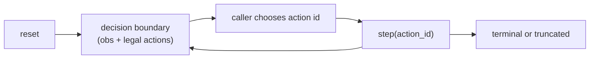
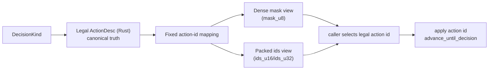
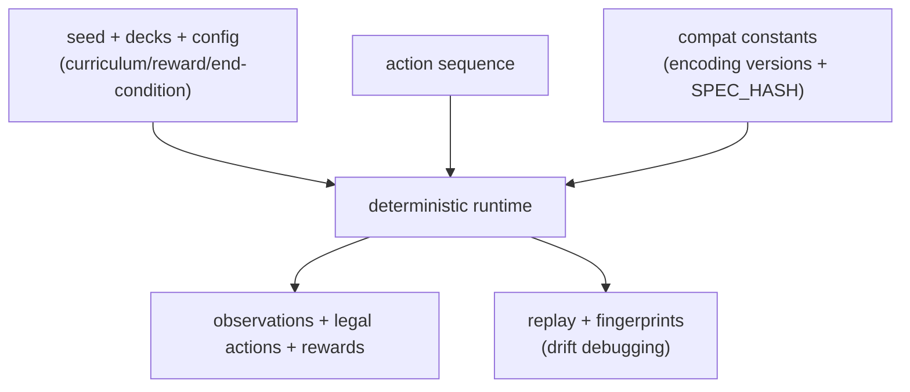

# How it works

This page is the mental model for how the simulator executes, where step boundaries occur, and how determinism is preserved.

If this page and the code disagree, **the code is authoritative** and this page must be updated in the same PR.

## The core idea: decision-boundary stepping

The engine runs an internal loop (`advance_until_decision`) and only returns control to the caller at *decision boundaries*:

- A caller provides **exactly one action id** for the current boundary.
- The engine applies it, then advances internally (phases, triggers, stack, timing) until the next boundary.
- One external `step()` may cover many internal transitions.
- The returned batch contains the next observation plus the next set of legal actions.

## Who acts next: `to_play_seat` / `actor`

At each boundary, the engine reports which seat must act next:

- High-level API: `ResetBatch.to_play_seat` / `StepBatch.to_play_seat`
- Low-level API: `BatchOut*.actor`

Conventions:

- seat ids are `0` or `1`
- `-1` means “no actor” (for example, terminal rows)

This is the value you should use to decide “which policy acts now” in self-play or league-style evaluation.

## Legal actions: one truth source, multiple views

Legality is derived, not duplicated:

1. Rust builds a canonical list of legal `ActionDesc` values for the current `DecisionKind`
2. those actions are mapped into a **fixed action-id space**
3. Python receives derived views of that legality:
   - a dense mask (`legal_mask` / `masks`) and/or
   - packed ids + offsets (`legal_ids`, `legal_offsets`)

Implication: legality bugs should be fixed where actions are generated in Rust; masks/ids are just views over that truth.

## Surfaces exposed to Python

The repository exposes two primary integration layers:

- **High-level**: `weiss_sim.make(...)` / `fast(...)` / `inspect(...)` -> `WeissEnv`
  - stable batch types (`ResetBatch`, `StepBatch`)
  - ergonomic legality helpers via `batch.legal`
  - recommended starting point for most RL and evaluation loops
- **Low-level**: `EnvPool` + canonical layout/buffer helpers
  - `weiss_sim.make_pool(...)`, `EnvPoolBuffers`, `reset_rl(...)`, `step_rl(...)`
  - designed for throughput and direct ownership of numpy buffers

Both layers share the same contract boundaries. The difference is ergonomics vs. control/allocation patterns.

## Determinism and reproducibility

Determinism comes from explicit ordering and explicit compatibility boundaries.

To reproduce trajectories, keep **all** of the following fixed:

1. seed (and episode seed derivation)
2. decks and DB/catalog inputs
3. curriculum/reward/end-condition settings
4. action sequence
5. compatibility constants (`OBS_ENCODING_VERSION`, `ACTION_ENCODING_VERSION`, `SPEC_HASH`, replay/wsdb schema versions)

Recommended integration practice:

- persist `spec_hash` in checkpoints/artifacts
- store replays when debugging drift (`docs/replays_determinism.md`)

## Related

- [Quickstart](quickstart.md)
- [RL Contract](rl_contract.md)
- [Python API Guide](python_api.md)
- [Encodings](encodings.md)
- [Replays & Determinism](replays_determinism.md)

