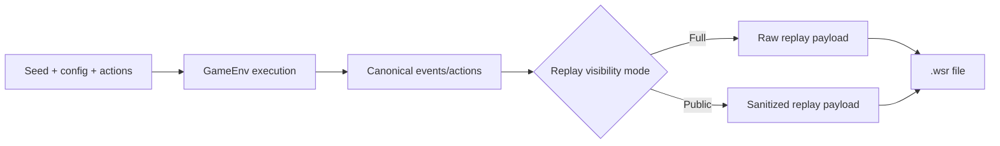

# Replays & Determinism

Replay artifacts are deterministic when seed/config/actions are held constant.

## Replay pipeline



## File format

Replay files (`.wsr`) include:

- magic: `WSR1`
- flags (compression + payload-length encoding)
- postcard payload (`ReplayData`)

Compression is feature-gated (`replay-zstd`).

## Replay schema and payload

- `REPLAY_SCHEMA_VERSION = 2`
- header fields include versions, seeds, `spec_hash`, `config_hash`, `fingerprint_algo`, env/episode ids
- body includes actions/action ids, optional events, step metadata, and final-state summary

Primary source: `weiss_core/src/replay.rs`.

## Visibility model

Replay visibility mode is explicit in replay config:

- `Full`: raw actions/events
- `Public`: sanitized actions/events safe for broader sharing

Important detail:

- replay sanitization in public mode is controlled by replay visibility mode
- it does not require `curriculum.enable_visibility_policies`

## Determinism checklist

To compare two runs, verify in order:

1. replay header versions and hashes (`obs/action/replay`, `spec_hash`, `config_hash`)
2. seeds (`seed`, `base_seed`, `episode_seed`)
3. action sequence (`actions`/`action_ids`)
4. events/final-state hash
5. engine status logs for faults

## Python entry point

Enable replay sampling via pool:

```python
pool.enable_replay_sampling(
    sample_rate=0.01,
    out_dir="replays",
    compress=False,
    visibility_mode="public",
    store_actions=True,
)
```

## Operational guidance

- keep replay samples for long training jobs at low rate
- store replay path + episode metadata in logs
- keep at least one deterministic golden replay in regression workflows

## Related

- [RL Contract](rl_contract.md)
- [Invariants & Validation](invariants_validation.md)
- [Troubleshooting](troubleshooting.md)
