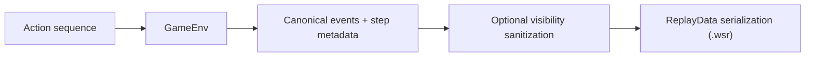

# Replays & Determinism

**TL;DR**
- Replays are deterministic artifacts when seed, config, and actions match.
- Replay payloads store enough metadata for drift detection.
- Public sanitization happens at serialization/output boundaries.

[Overview](README.md) | [Quickstart](quickstart.md) | [Engine](engine_architecture.md) | [RL Contract](rl_contract.md) | [Encodings](encodings.md) | [Performance](performance_benchmarks.md) | Replays | [Rules](rules_coverage.md) | [Invariants](invariants_validation.md) | [Contributing](contributing.md)

---

## Replay pipeline

---

## Replay payload structure

Replay payload = `header + body`.

Header includes reproducibility metadata such as:

- `obs_version`, `action_version`, `replay_version`
- `seed`, `base_seed`, `episode_seed`
- `spec_hash`, `config_hash`, `fingerprint_algo`
- `starting_player`, `deck_ids`
- `env_id`, `episode_index`

Body includes:

- canonical action descriptors (`actions`)
- aligned action ids when available (`action_ids`)
- optional event stream (`events`)
- per-step metadata (`steps`)
- optional final summary (`final_state`)

Schema source: `weiss_core/src/replay.rs`.

---

## Determinism model

Two runs are expected to match when all of these match:

1. episode seed path
2. action sequence
3. config/curriculum/reward policy
4. encoding and replay schema versions

Drift diagnosis workflow:

1. compare replay headers first (`spec_hash`, `config_hash`, seeds)
2. compare action sequences (`actions` / `action_ids`)
3. compare event streams and final state hash
4. check for engine errors during run (`engine_status`)

---

## Visibility and sanitization

Visibility mode is explicit in replay configuration:

- `Full`: includes private information
- `Public`: sanitized for public-safe outputs

Current behavior notes:

- sanitization is output-boundary logic, not core-state mutation
- hidden-zone identity is masked in public-safe outputs
- replay sanitization in public mode is global/viewer-agnostic

Use `Public` mode for sharing artifacts outside trusted internal debugging contexts.

---

## File format and storage notes

Replay files (`.wsr`) include:

- magic prefix (`WSR1`)
- flags (compression bit)
- payload length
- postcard-encoded payload bytes

Compression support is feature-gated (`replay-zstd`).

Operational tips:

- include replay files in CI artifacts for flaky determinism investigations
- store replay version + git SHA together in experiment metadata
- avoid mixing replay artifacts from incompatible schema versions

---

## Minimal usage guidance

Typical usage pattern in training/eval harnesses:

1. enable replay sampling at low sample rate in long runs
2. use public visibility for shared artifacts
3. log replay file path with episode index and seed
4. keep at least one deterministic golden replay in regression tests

---

## Related

- [RL contract](rl_contract.md)
- [Invariants & validation](invariants_validation.md)
- [Troubleshooting](troubleshooting.md)
