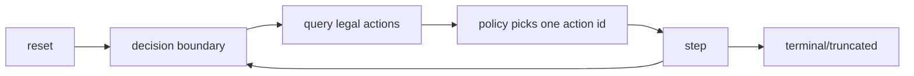

# RL Contract & Reference Loops

**TL;DR**
- Steps are decision-based, not micro-transition based.
- Legal actions are canonical; masks and legal-id arrays are derived views.
- Determinism is defined by seed + action sequence + config + contract versions.

[Overview](README.md) | [Quickstart](quickstart.md) | [Engine](engine_architecture.md) | RL Contract | [Encodings](encodings.md) | [Performance](performance_benchmarks.md) | [Replays](replays_determinism.md) | [Rules](rules_coverage.md) | [Invariants](invariants_validation.md) | [Contributing](contributing.md)

---

## On this page

- Contract scope
- Step semantics
- Output schema (minimal batches)
- Decision and engine-status encodings
- Reference loops
- Determinism and seed handling
- Compatibility checksum

---

## Contract scope

This contract governs:

- output tensor meanings and shape conventions
- how legal actions are surfaced
- termination/truncation semantics
- compatibility markers (`*_ENCODING_VERSION`, `SPEC_HASH`)

This contract does not define full game rules coverage. For that, see [Rules coverage](rules_coverage.md).

---

## Step semantics

One call to `step` does the following per environment:

1. applies exactly one caller-chosen action id
2. runs internal engine transitions until the next decision boundary
3. returns one row of outputs for that next boundary (or terminal/truncated state)



Key point: callers should not assume one step == one phase event.

---

## Output schema (minimal batches)

Default `EnvPoolBuffers` output fields:

| Field | Type | Shape | Meaning |
| --- | --- | --- | --- |
| `obs` | `int32` | `(num_envs, OBS_LEN)` | encoded observation at next boundary |
| `masks` | `bool/uint8`-compatible mask | `(num_envs, ACTION_SPACE_SIZE)` | legal action mask (if enabled) |
| `rewards` | `float32` | `(num_envs,)` | per-env step reward |
| `terminated` | `bool` | `(num_envs,)` | true for terminal outcomes |
| `truncated` | `bool` | `(num_envs,)` | true for max-decision/tick truncation |
| `actor` | `int8` | `(num_envs,)` | perspective actor index, or sentinel |
| `decision_kind` | `int8` | `(num_envs,)` | encoded decision kind, or sentinel |
| `decision_id` | `uint32` | `(num_envs,)` | monotonic decision id per env episode |
| `engine_status` | `uint8` | `(num_envs,)` | engine error code (`0` means OK) |
| `spec_hash` | `uint64` | `(num_envs,)` | combined compatibility hash |

Other buffer variants (`NoMask`, `I16`, `I16LegalIds`) trade output shape/dtype for throughput.

---

## Decision and engine-status encodings

### `decision_kind` values

The observation encoding maps decision kinds to:

| Value | Decision kind |
| --- | --- |
| `0` | `Mulligan` |
| `1` | `Clock` |
| `2` | `Main` |
| `3` | `Climax` |
| `4` | `AttackDeclaration` |
| `5` | `LevelUp` |
| `6` | `Encore` |
| `7` | `TriggerOrder` |
| `8` | `Choice` |
| `-1` | no active decision |

### `engine_status` values

| Value | Name | Meaning |
| --- | --- | --- |
| `0` | `None` | no engine error |
| `1` | `StackAutoResolveCap` | stack auto-resolve cap exceeded |
| `2` | `TriggerQuiescenceCap` | trigger quiescence cap exceeded |
| `3` | `Panic` | trapped panic during step/runtime |
| `4` | `ActionError` | action application failed |
| `5` | `InvariantViolation` | runtime invariant violation latched |
| `6` | `ResetError` | reset path returned an error |
| `7` | `ResetPanic` | trapped panic during reset |

If you see non-zero values in long runs, log and reset those envs deterministically.

### Fault contract (latched per env)

This contract applies to runtime/step fault codes `1-5`. Reset errors
(`ResetError=6`, `ResetPanic=7`) are reset-path faults and do not use the
"subsequent pre-reset step" semantics below.

- Fault rows are emitted with `truncated=True` and `terminated=False`.
- Fault reward uses actor perspective:
  - actor known: `reward = terminal_loss` (default `-1.0`, configurable via `reward_json`)
  - actor unknown: `reward = terminal_draw` (default `0.0`, and must be `0.0` under validated zero-sum rewards)
- No shaping is emitted on fault rows.
- Fault is sticky until reset: subsequent pre-reset steps for that env emit
  `reward=0.0`, unchanged non-zero `engine_status`, and truncated fault flags.
- In pool mode, per-env runtime faults do not abort the batch.

---

## Reference loops

Threading note for Python RL constructors:

- `EnvPool.new_rl_train/new_rl_eval` default `num_threads=None` resolves to
  CPU parallelism (capped by `num_envs`).
- Pass `num_threads=1` to force serial execution.
- `pool.num_threads` reports the effective thread count.

### Mask-based loop (simple baseline)

```python
import numpy as np
import weiss_sim

pool = weiss_sim.EnvPool.new_rl_train(...)
buf = weiss_sim.EnvPoolBuffers(pool)
out = buf.reset()

for _ in range(1024):
    actions = np.full(pool.envs_len, weiss_sim.PASS_ACTION_ID, dtype=np.uint32)
    for i in range(pool.envs_len):
        row = out.masks[i]
        legal = np.flatnonzero(row)
        if legal.size:
            actions[i] = int(legal[0])
    out = buf.step(actions)
```

### Legal-id loop (throughput-oriented)

```python
ids, offsets = buf.legal_action_ids()
actions = np.full(pool.envs_len, weiss_sim.PASS_ACTION_ID, dtype=np.uint32)

for i in range(pool.envs_len):
    start = int(offsets[i])
    end = int(offsets[i + 1])
    actions[i] = weiss_sim.PASS_ACTION_ID if start == end else int(ids[start])

out = buf.step(actions)
```

### Robust loop with error auto-reset

```python
codes = np.zeros(pool.envs_len, dtype=np.uint8)
for _ in range(10000):
    actions = np.full(pool.envs_len, weiss_sim.PASS_ACTION_ID, dtype=np.uint32)
    for i in range(pool.envs_len):
        row = out.masks[i]
        legal = np.flatnonzero(row)
        if legal.size:
            actions[i] = int(legal[0])
    out = buf.step(actions)
    codes[:] = out.engine_status
    if np.any(codes != 0):
        pool.auto_reset_on_error_codes_into(codes, buf.out)
```

---

## Determinism and seed handling

Deterministic replayability requires all of the following to match:

1. base seed and per-episode seed derivation
2. action sequence per env episode
3. config and curriculum flags
4. encoding/schema versions (`OBS/ACTION/REPLAY`)

Helpful metadata surfaces:

- `episode_seed_batch()`
- `episode_index_batch()`
- `env_index_batch()`
- `starting_player_batch()`

Use these for reproducibility logs in training infrastructure.

---

## Compatibility checksum

Values come from `weiss_core::encode` constants. Update this table only when constants change intentionally.

| Field | Value |
| --- | --- |
| OBS_LEN | 378 |
| ACTION_SPACE_SIZE | 527 |
| OBS_ENCODING_VERSION | 2 |
| ACTION_ENCODING_VERSION | 1 |
| SPEC_HASH | 8590000130 |

---

## Related

- [Encodings](encodings.md)
- [Encodings changelog](encodings_changelog.md)
- [Replays & determinism](replays_determinism.md)
- [Python API guide](python_api.md)
