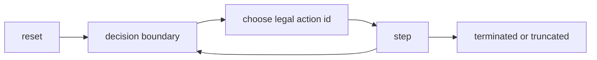

# RL Contract

This is the integration contract for stepping semantics, output payloads, and compatibility checksums.

If this page and code disagree, code is authoritative and this page must be updated in the same PR.

## Contract scope

This contract covers:

- step/reset boundary semantics
- output fields and meanings
- legal action surfaces
- compatibility constants and `SPEC_HASH`

Rules coverage, scraper boundaries, replay schema, and WSDB schema notes live in
[Architecture](architecture.md).

## Step semantics

One `step` call per env:

1. applies exactly one caller-selected action id
2. advances internal runtime until next decision or terminal/truncated boundary
3. emits one row for that boundary



## Reward semantics

Reward values are reported per-step and are computed from the **acting player’s perspective** for that boundary.

Intuition:

- the engine identifies the current actor (`to_play_seat` / `actor`)
- the caller supplies an action id for that actor
- the returned reward is computed relative to that actor (the seat that took the action)

This alignment is intentional: it supports self-play style training/evaluation where a single policy can act for both seats while still receiving correctly-signed rewards for whichever seat acted.

Non-terminal behavior:

- if shaping rewards are disabled, non-terminal rewards are `0.0`
- if shaping rewards are enabled, the current shaping term is applied from the actor’s perspective

Terminal behavior:

- win/loss rewards use the configured `terminal_win` / `terminal_loss`
- draws use `terminal_draw`
- timeouts/truncations use `terminal_timeout`

Fault behavior (engine errors):

- faults latch `engine_status != 0` and emit `truncated=True`
- a latched fault emits a terminal-loss reward at most once (for the known actor); subsequent fault rows emit `0.0` until reset

Reward configuration defaults (`RewardConfig`):

- `terminal_win = 1.0`
- `terminal_loss = -1.0`
- `terminal_draw = 0.0`
- `terminal_timeout = 0.0`
- `enable_shaping = false`
- `damage_reward = 0.1`
- `level_reward = 0.0`
- `board_reward = 0.0`
- `no_progress_penalty = 0.0`

High-level Python code should prefer `reward=weiss_sim.RewardOverrides(...)`.
The compatibility `reward_json` argument accepts the same keys as JSON.
Unknown reward fields are rejected.

Reward schema keys match `RewardConfig` field names:

- `terminal_win` (float)
- `terminal_loss` (float)
- `terminal_draw` (float)
- `terminal_timeout` (float)
- `enable_shaping` (bool)
- `damage_reward` (float)
- `level_reward` (float, default `0.0`)
- `board_reward` (float, default `0.0`)
- `no_progress_penalty` (float, default `0.0`)

## Core output schema

Typical low-level outputs (`BatchOut*` / buffer wrappers):

| Field | Shape | Meaning |
| --- | --- | --- |
| `obs` | `(N, OBS_LEN)` | observation vector |
| `rewards` | `(N,)` | per-step reward |
| `terminated` | `(N,)` | terminal result reached |
| `truncated` | `(N,)` | limit/fault truncation |
| `actor` | `(N,)` | acting player for boundary (`-1` sentinel when none) |
| `decision_kind` | `(N,)` | encoded decision kind (`-1` sentinel when none) |
| `decision_id` | `(N,)` | per-env monotonic decision index |
| `engine_status` | `(N,)` | engine fault code (`0` healthy) |
| `spec_hash` | `(N,)` | compatibility hash |
| `main_move_action` | `(N,)` | whether the last transition consumed the once-per-turn main move |
| `main_pass_action` | `(N,)` | whether the last transition passed main |

`BatchOutDebug.reward_components` has shape `(N, 5)` and is debug-only. The
fixed component order is `terminal`, `damage`, `level`, `board`, `no_progress`;
each row sums to `rewards[i]` except for floating-point roundoff.

Low-level legal action surfaces:

- dense mask (`masks`) when enabled
- packed ids (`legal_ids`, `legal_offsets`) depending on buffer/API mode
- aligned packed metadata (`legal_action_meta`) when the selected packed-id layout includes it
- `i16_legal_ids_nometa` keeps packed ids and omits `legal_action_meta` for hot RL loops that do not consume action metadata
- opt-in dynamic action context via `EnvPoolBuffers.legal_action_context_v1(...)`;
  this is not emitted by default and is aligned 1:1 with the used
  `legal_ids[:legal_offsets[-1]]` prefix
- `weiss_sim.human_decision_view(pool, env_index=0, perspective_seat=None)` is
  a display-only, redacted dict for human play/study UIs. Its `legal_actions`
  are decoded from the same current legal-id cache and preserve simulator order;
  clients should submit the exact returned `action_id`, not reconstruct moves.
  Legal ids/actions are actor-only, non-actor perspectives receive empty action
  lists, deck and stock contents are count-only for every viewer, and the view
  intentionally omits deterministic episode seed material.

## High-level batch schema (`ResetBatch` / `StepBatch`)

Common fields:

- `obs`, `to_play_seat`, `starting_seat`
- `episode_seed`, `episode_index`, `env_index`, `episode_key`
- `decision_id`, `engine_status`, `spec_hash`
- `main_move_action`, `main_pass_action`
- optional legal surfaces: `legal_mask`, `legal_ids`, `legal_offsets`, `legal_action_meta`

Flag semantics:

- on `ResetBatch`, `main_move_action` and `main_pass_action` are always `False`
- on `StepBatch`, they describe the action that produced the current boundary row

Preferred high-level legal API:

- use `batch.legal` for ids/mask/logit helpers
- `legal_ids`, `legal_offsets`, and `legal_action_meta` remain available as raw properties for advanced integration

`StepBatch` adds:

- `reward`, `terminated`, `truncated`
- `terminal_during_internal_opponent`
- `decision_count`, `tick_count`, `no_progress_count`

Invariants enforced in high-level path:

- `terminated` and `truncated` are never both true at one index
- legal ids (when present) are strictly ascending and unique per env slice
- legal metadata (when present) is aligned 1:1 with the used `legal_ids` prefix

Logits sampling seed semantics:

- fused logits samplers deterministically mix each caller-provided `u64` seed before converting it to a unit uniform sample
- this makes small sequential seed buffers safe to use without collapsing softmax sampling toward the first legal action

`batch.legal` behavior:

- `batch.legal.ids(i)` returns legal action ids for env `i`
- `batch.legal.meta(i)` returns packed action metadata rows for env `i`
- `batch.legal.mask` returns dense legal mask view
- `batch.legal.argmax_logits(...)` / `sample_logits(...)` enforce legality

## Decision kind encoding

From observation encoding:

| Value | DecisionKind |
| --- | --- |
| `0` | `Mulligan` |
| `1` | `Clock` |
| `2` | `Main` |
| `3` | `Climax` |
| `4` | `AttackDeclaration` |
| `5` | `LevelUp` |
| `6` | `Encore` |
| `7` | `TriggerOrder` |
| `8` | `Choice` |
| `-1` | none |

## Engine status encoding

| Value | Name |
| --- | --- |
| `0` | `None` |
| `1` | `StackAutoResolveCap` |
| `2` | `TriggerQuiescenceCap` |
| `3` | `Panic` |
| `4` | `ActionError` |
| `5` | `InvariantViolation` |
| `6` | `ResetError` |
| `7` | `ResetPanic` |

Fault-row behavior:

- fault rows are emitted with `truncated=True`
- runtime fault state is latched until reset
- batch stepping continues for other envs

## Determinism requirements

Reproducible runs require all of the following to match:

1. seed path (`seed` / derived episode seeds)
2. action sequence
3. config/curriculum/reward/end-condition settings
4. compatibility constants (`OBS/ACTION/POLICY`, replay/wsdb schema)

Useful metadata surfaces:

- `episode_seed_batch()`
- `episode_index_batch()`
- `env_index_batch()`
- `starting_player_batch()`

## Compatibility checksum table

These values are read from `weiss_core/src/encode/constants.rs`.

| Field | Value |
| --- | --- |
| OBS_LEN | 378 |
| ACTION_SPACE_SIZE | 527 |
| OBS_ENCODING_VERSION | 2 |
| ACTION_ENCODING_VERSION | 1 |
| SPEC_HASH | 8590000130 |

## Structured action metadata

Structured-policy integrations can rely on exported helper blocks from
`weiss_sim.spec_bundle()` / `weiss_sim.export_spec_bundle()`:

- `action_factorization_v1`: stable action-family schema for `family` + `arg0/arg1/arg2`
- `action_meta_v1`: packed legal-row layout mirrored by `legal_action_meta`
- `legal_action_context_v1`: optional dynamic legal-row context schema

### Legal action context v1

`EnvPoolBuffers.legal_action_context_v1(out=None)` materializes an optional
dynamic context matrix for the current decision boundary. It returns
`(context, legal_offsets)`, where:

- `context.dtype == np.int32`
- `context.shape == (legal_offsets[-1], LEGAL_ACTION_CONTEXT_V1_WIDTH)`
- each context row corresponds to the same row in the packed legal id prefix
- unused fields are `LEGAL_ACTION_CONTEXT_UNUSED` (`-1`)

Current field order:

| Column | Meaning |
| ---: | --- |
| 0 | action family code |
| 1 | action arg0 |
| 2 | action arg1 |
| 3 | action arg2 |
| 4 | decision kind |
| 5 | actor seat |
| 6 | source zone code |
| 7 | source index within zone |
| 8 | source card id |
| 9 | source card type code |
| 10 | source card color code |
| 11 | source card level |
| 12 | source card cost |
| 13 | source card power |
| 14 | source card soul |

The context is computed from the actor's current legal choices and
actor-visible/action source state. Hidden opponent choice options keep the zone
code but use the unused sentinel for source index and card-derived fields. Treat
it as an opt-in learning feature: it can make action semantics easier for a
policy to consume, but it adds extra per-step work if materialized every
decision.

## Reference loop patterns

Mask-based baseline:

```python
import numpy as np
import weiss_sim

pool, buf = weiss_sim.make_pool(
    mode="train",
    num_envs=64,
    deck_lists=[deck_a, deck_b],
    layout="mask",
)
out = buf.reset()

for _ in range(1000):
    actions = np.full(pool.envs_len, weiss_sim.PASS_ACTION_ID, dtype=np.uint32)
    for i in range(pool.envs_len):
        legal = np.flatnonzero(out.masks[i])
        if legal.size:
            actions[i] = int(legal[0])
    out = buf.step(actions)
```

RL helper baseline (same contract, no manual buffer wrapper):

```python
pool, _ = weiss_sim.make_pool(
    mode="train",
    num_envs=64,
    deck_lists=[deck_a, deck_b],
    layout="mask",
)
step = weiss_sim.reset_rl(pool, layout="mask")
for _ in range(1000):
    actions = np.full(pool.envs_len, weiss_sim.PASS_ACTION_ID, dtype=np.uint32)
    for i in range(pool.envs_len):
        legal = np.flatnonzero(step.masks[i])
        if legal.size:
            actions[i] = int(legal[0])
    step = weiss_sim.step_rl(pool, actions, layout="mask")
```

## Advanced: raw packed legality arrays

When you need packed legality payloads directly, use:

- `batch.legal_ids`
- `batch.legal_offsets`
- optional `batch.legal_mask`

Packed ids are authoritative for their selected representation and remain part of the stable contract, but higher-level integrations should prefer `batch.legal`.

Packed-id pattern:

```python
ids, offsets = buf.legal_action_ids()
actions = np.full(pool.envs_len, weiss_sim.PASS_ACTION_ID, dtype=np.uint32)
for i in range(pool.envs_len):
    start = int(offsets[i])
    end = int(offsets[i + 1])
    actions[i] = weiss_sim.PASS_ACTION_ID if start == end else int(ids[start])
out = buf.step(actions)
```

## Related

- [Python API](python_api.md)
- [Architecture](architecture.md)
- [Performance](performance_benchmarks.md)
