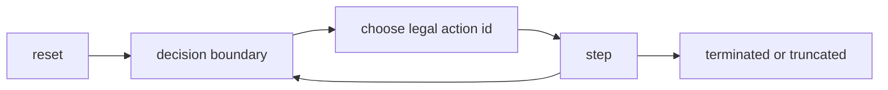

# RL Contract

This is the integration contract for stepping semantics, output payloads, and compatibility checksums.

If this page and code disagree, code is authoritative and this page must be updated in the same PR.

## Contract scope

This contract covers:

- step/reset boundary semantics
- output fields and meanings
- legal action surfaces
- compatibility constants and `SPEC_HASH`

This contract does not describe full rules coverage. See [Rules Coverage](rules_coverage.md).

## Step semantics

One `step` call per env:

1. applies exactly one caller-selected action id
2. advances internal runtime until next decision or terminal/truncated boundary
3. emits one row for that boundary



## Core output schema

Typical low-level outputs (`BatchOut*` / buffer wrappers):

| Field | Shape | Meaning |
| --- | --- | --- |
| `obs` | `(N, OBS_LEN)` | observation vector |
| `rewards` | `(N,)` | per-step reward |
| `terminated` | `(N,)` | terminal result reached |
| `truncated` | `(N,)` | limit/fault truncation |
| `actor` | `(N,)` | acting player for boundary (`-1` sentinel when none) |
| `decision_kind` | `(N,)` | encoded decision kind (`-1` sentinel when none) |
| `decision_id` | `(N,)` | per-env monotonic decision index |
| `engine_status` | `(N,)` | engine fault code (`0` healthy) |
| `spec_hash` | `(N,)` | compatibility hash |

Low-level legal action surfaces:

- dense mask (`masks`) when enabled
- packed ids (`legal_ids`, `legal_offsets`) depending on buffer/API mode

## High-level batch schema (`ResetBatch` / `StepBatch`)

Common fields:

- `obs`, `to_play_seat`, `starting_seat`
- `episode_seed`, `episode_index`, `env_index`, `episode_key`
- `decision_id`, `engine_status`, `spec_hash`
- optional legal surfaces: `legal_mask`, `legal_ids`, `legal_offsets`

Preferred high-level legal API:

- use `batch.legal` for ids/mask/logit helpers
- `legal_ids` and `legal_offsets` remain available as raw properties for advanced integration

`StepBatch` adds:

- `reward`, `terminated`, `truncated`
- `terminal_during_internal_opponent`
- `decision_count`, `tick_count`

Invariants enforced in high-level path:

- `terminated` and `truncated` are never both true at one index
- legal ids (when present) are strictly ascending and unique per env slice

`batch.legal` behavior:

- `batch.legal.ids(i)` returns legal action ids for env `i`
- `batch.legal.mask` returns dense legal mask view
- `batch.legal.select_from_logits(...)` / `sample_from_logits(...)` enforce legality

## Decision kind encoding

From observation encoding:

| Value | DecisionKind |
| --- | --- |
| `0` | `Mulligan` |
| `1` | `Clock` |
| `2` | `Main` |
| `3` | `Climax` |
| `4` | `AttackDeclaration` |
| `5` | `LevelUp` |
| `6` | `Encore` |
| `7` | `TriggerOrder` |
| `8` | `Choice` |
| `-1` | none |

## Engine status encoding

| Value | Name |
| --- | --- |
| `0` | `None` |
| `1` | `StackAutoResolveCap` |
| `2` | `TriggerQuiescenceCap` |
| `3` | `Panic` |
| `4` | `ActionError` |
| `5` | `InvariantViolation` |
| `6` | `ResetError` |
| `7` | `ResetPanic` |

Fault-row behavior:

- fault rows are emitted with `truncated=True`
- runtime fault state is latched until reset
- batch stepping continues for other envs

## Determinism requirements

Reproducible runs require all of the following to match:

1. seed path (`seed` / derived episode seeds)
2. action sequence
3. config/curriculum/reward/end-condition settings
4. compatibility constants (`OBS/ACTION/POLICY`, replay/wsdb schema)

Useful metadata surfaces:

- `episode_seed_batch()`
- `episode_index_batch()`
- `env_index_batch()`
- `starting_player_batch()`

## Compatibility checksum table

These values are read from `weiss_core/src/encode/constants.rs`.

| Field | Value |
| --- | --- |
| OBS_LEN | 378 |
| ACTION_SPACE_SIZE | 527 |
| OBS_ENCODING_VERSION | 2 |
| ACTION_ENCODING_VERSION | 1 |
| SPEC_HASH | 8590000130 |

## Reference loop patterns

Mask-based baseline:

```python
import numpy as np
import weiss_sim

pool, buf = weiss_sim.make_pool(
    mode="train",
    num_envs=64,
    deck_lists=[deck_a, deck_b],
    layout="mask",
)
out = buf.reset()

for _ in range(1000):
    actions = np.full(pool.envs_len, weiss_sim.PASS_ACTION_ID, dtype=np.uint32)
    for i in range(pool.envs_len):
        legal = np.flatnonzero(out.masks[i])
        if legal.size:
            actions[i] = int(legal[0])
    out = buf.step(actions)
```

RL helper baseline (same contract, no manual buffer wrapper):

```python
pool, _ = weiss_sim.make_pool(
    mode="train",
    num_envs=64,
    deck_lists=[deck_a, deck_b],
    layout="mask",
)
step = weiss_sim.reset_rl(pool, layout="mask")
actions = np.full(pool.envs_len, weiss_sim.PASS_ACTION_ID, dtype=np.uint32)
for i in range(pool.envs_len):
    legal = np.flatnonzero(step.masks[i])
    if legal.size:
        actions[i] = int(legal[0])
step = weiss_sim.step_rl(pool, actions, layout="mask")
```

## Advanced: raw packed legality arrays

When you need packed legality payloads directly, use:

- `batch.legal_ids`
- `batch.legal_offsets`
- optional `batch.legal_mask`

Packed ids are authoritative for their selected representation and remain part of the stable contract, but higher-level integrations should prefer `batch.legal`.

Packed-id pattern:

```python
ids, offsets = buf.legal_action_ids()
actions = np.full(pool.envs_len, weiss_sim.PASS_ACTION_ID, dtype=np.uint32)
for i in range(pool.envs_len):
    start = int(offsets[i])
    end = int(offsets[i + 1])
    actions[i] = weiss_sim.PASS_ACTION_ID if start == end else int(ids[start])
out = buf.step(actions)
```

## Related

- [Encodings](encodings.md)
- [Encodings Changelog](encodings_changelog.md)
- [Python API](python_api.md)
- [Replays & Determinism](replays_determinism.md)
